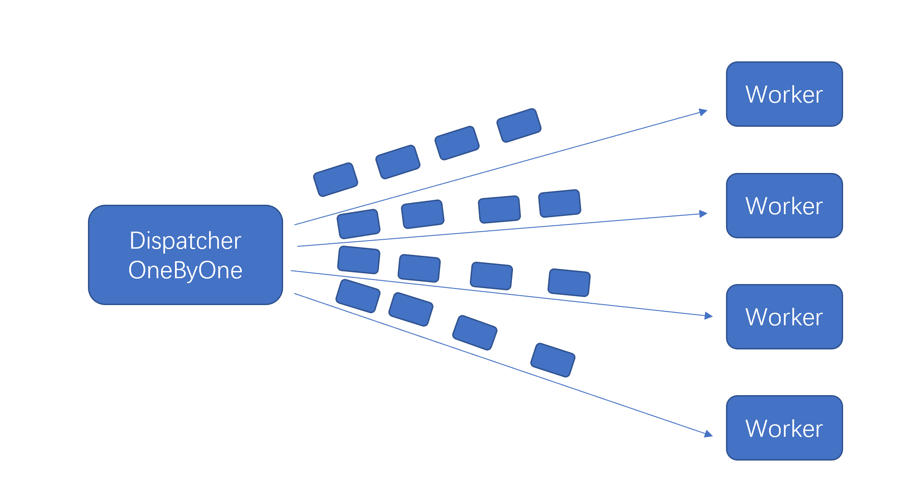

# 介绍
  这个demo是实现了一个dispatcher和worker的模型，dispatcher负责分发任务，worker负责执行计算任务。
这里例子是实现了一个简单的计算任务，计算一个chunk内a字符的数量。

# Dispatching OneByOne

分发器负责轮询地分发数据，先分发一批数据给worker，得到计算时间，再根据每个worker的工作时间，按照小到大排序，作为一个工作速度，工作快的worker分发的数据就更多。